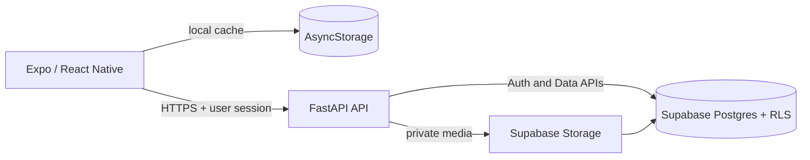

# Chronous

Chronous is a digital time-capsule app for letters, goals, predictions, photo memories, and shared capsules built with friends. Capsules remain sealed until a trusted database timestamp reaches their unlock date.

## Architecture



The mobile application connects only to FastAPI. Supabase configuration and Data API connections remain in the backend.

- `capsules` stores participant-visible metadata and trusted unlock timestamps.
- `capsule_items` stores letters, goals, predictions, contributions, and photo references.
- `profiles` stores display names and friend handles.
- `friendships` stores pending and accepted friend relationships.
- `capsule_members` grants invited friends access to shared capsules.
- PostgreSQL RLS protects drafts, sealed content, collaborative contributions, and private media.
- `seal_capsule()` hashes and seals capsule contents.
- `reveal_capsule()` verifies database time before returning protected contents.

## Repository layout

```text
mobile/      Expo SDK 54 React Native application
api/         FastAPI backend-for-frontend
supabase/    PostgreSQL migrations, functions, RLS, and Storage policies
```

## Run the API

Prerequisites: Python 3.12+.

```powershell
cd api
python -m venv .venv
.venv\Scripts\Activate.ps1
pip install -e ".[dev]"
```

Copy `api/.env.example` to `api/.env`, then configure it:

```dotenv
SUPABASE_URL=https://YOUR_PROJECT.supabase.co
SUPABASE_PUBLISHABLE_KEY=YOUR_PUBLISHABLE_KEY
PASSWORD_RESET_REDIRECT_URL=chronous://reset-password
```

Start the API so a physical phone can reach it:

```powershell
uvicorn app.main:app --reload --host 0.0.0.0 --port 8000
```

Useful endpoints include:

- `GET /health`
- `GET /v1/time`
- `/v1/auth/*`
- `/v1/friends/*`
- `/v1/capsules/*`
- `GET /docs`

## Run the mobile app

Prerequisites: Node.js 22.13+ and Expo Go or a simulator.

Copy `mobile/.env.example` to `mobile/.env` and use the computer's LAN address:

```dotenv
EXPO_PUBLIC_API_URL=http://YOUR-LAN-IP:8000
```

Then run:

```powershell
cd mobile
npm install
npx expo start
```

Press `a` for Android, `i` for iOS, or scan the QR code with Expo Go. Keep a physical phone and the computer on the same network.

## Supabase migrations

Apply every SQL file in `supabase/migrations` in filename order. They create:

- Capsule, payload, audit, profile, friendship, and membership tables
- Authenticated account and friendship workflows
- Shared and collaborative capsule authorization
- Trusted-time sealing and reveal functions
- Private `capsule-media` Storage policies
- RLS recursion hardening for capsule membership checks

## Quality checks

```powershell
cd mobile
npm run typecheck

cd ..\api
ruff check .
pytest
```
